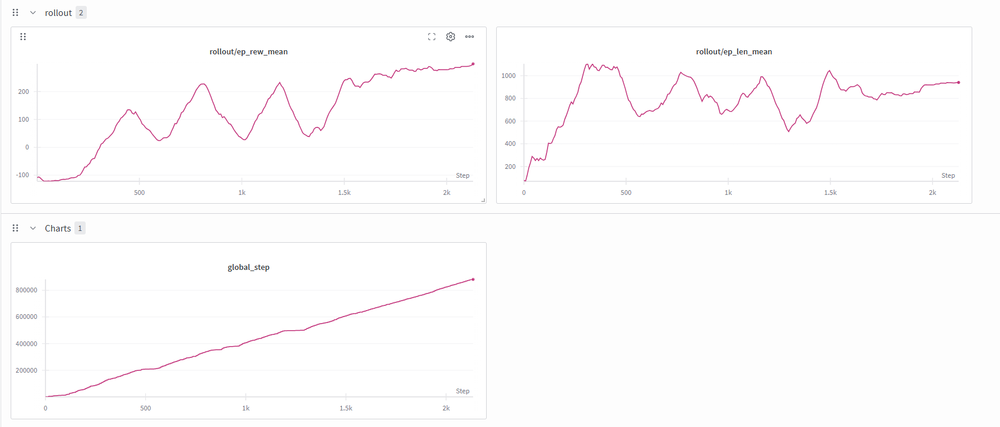

# Soft Actor-Critic (SAC) for BipedalWalker-v3


A high-performance, production-grade solution for the continuous control task `BipedalWalker-v3` using **Stable Baselines3 (SB3)**. This project leverages optimized hyperparameters and vectorized environments to achieve rapid convergence.

## Project Goal

To solve the BipedalWalker-v3 environment (Reward > 300) using a robust, industry-standard implementation, focusing on:
*   **Sample Efficiency**: Tuning SAC hyperparameters (Entropy, Batch Size).
*   **Exploration**: overcoming the local optima of "standing still" or "doing the splits".
*   **Reproducibility**: Dockerized and seeded for consistent results.

## Configuration

The current stable configuration is designed for **Maximum Exploration** to prevent local optima:

*   **Algorithm**: **Modern Soft Actor-Critic (SAC)** (Haarnoja et al., 2019)
    *   **Auto-Tuned Entropy**: Learnable temperature parameter ($\alpha$) that automatically balances exploration/exploitation.
    *   **Double Q-Learning**: Two critics ($Q_1, Q_2$) minimize overestimation bias.
    *   **No Value Network**: Explicit $V(s)$ network is removed; value is implicitly approximated via $Q$.
    *   **Experience Replay**: Off-policy learning from a large buffer of past transitions for maximum sample efficiency.
    *   **Reparameterization Trick**: Low-variance gradient updates for the stochastic policy.
*   **Framework**: Stable Baselines3
*   **Environment**: `BipedalWalker-v3`
*   **Parallelism**: 4 Environments (Vectorized) for stable data collection.
*   **Entropy**: Forced High ($\alpha$ target = -2.0) to encourage diverse movement.
*   **Batch Size**: 256 (Standard) for noisy gradient updates.

## Project Structure

```bash
├── experiments/
│   ├── train_sb3.py    # Main training script (SB3)
│   └── record_video.py # Script to replay/record the trained agent
├── src/                # Custom SAC implementation (Reference)
├── final_sb3_model.zip # Solved Model (Reward > 300)
├── vec_normalize.pkl   # Normalization statistics
├── Dockerfile          # GPU-accelerated environment
├── environment.yml     # Conda dependencies
└── README.md           # Project documentation
```

## Getting Started

### Prerequisites
*   Conda (For local execution)
*   NVIDIA GPU (Recommended)
*   Weights & Biases Account (for logging)

### 1. Installation
```bash
# Clone the repository
git clone https://github.com/thomas-digregorio/rl-bipedal-sac.git
cd rl-bipedal-sac

# Create Environment
conda env create -f environment.yml
conda activate bipedal-sac
```

### 2. Train the Agent
```bash
python experiments/train_sb3.py
```
This will automatically:
1.  Launch the environment.
2.  Connect to W&B.
3.  Start training with the optimized hyperparameters.
4.  Save video replays to `videos/sb3/`.

### 3. Monitoring
View the training progress on your [Weights & Biases Dashboard](https://wandb.ai/).
Key metrics to watch:
*   `rollout/ep_rew_mean`: Should trend towards 300.
*   `rollout/ep_len_mean`: Should stabilize (not get stuck at 1000).

## Results

*   **Target Reward**: 300+ (Solved)
*   **Current Strategy**: High Entropy SAC.

### Final Agent Behavior
The agent successfully learned to run efficiently without falling.


### Training Metrics
The agent demonstrates stable convergence, solving the environment within 850k steps.


